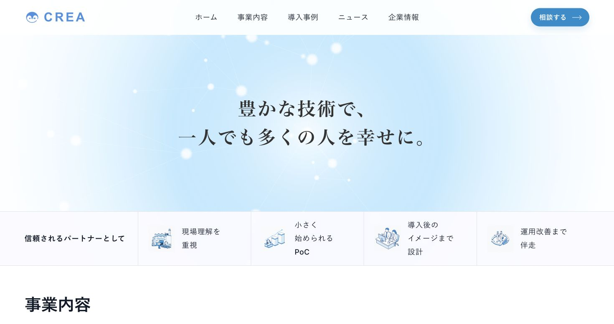
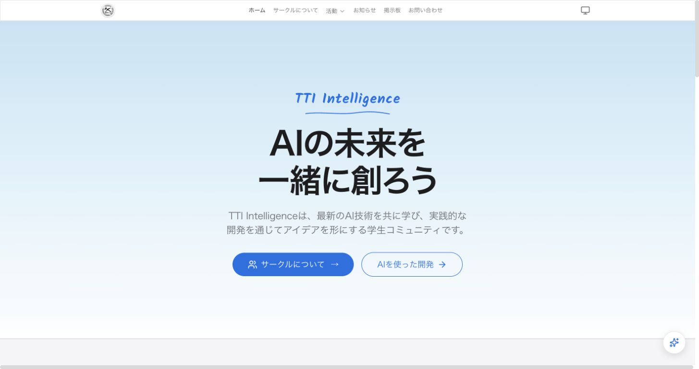

<table>
  <tr>
    <td width="180" valign="middle">
      
    </td>
    <td valign="middle">
      <h1>Haruhito Mabuchi</h1>
      <h3>AI / Web Developer</h3>
      
AIとWebを軸に、企画・情報設計・デザイン・実装・公開後の運用まで一貫して取り組んでいます。

    </td>
  </tr>
</table>

## Featured Works

### CREA Corporate Website

企業向けコーポレートサイトを、情報設計からデザイン、実装、レスポンシブ対応、公開・運用まで担当しました。

[Website](https://tech-crea.com/)

### TTI Intelligence

AI・開発コミュニティのWebサイトを、企画からフロントエンド、バックエンド、AI機能、AWS、デプロイ、運用まで一貫して開発しています。

[Website](https://tti-intel.com/)

## Focus

- AIを組み込んだWebアプリケーション
- React / TypeScriptによるフロントエンド開発
- AWSを利用したバックエンド・インフラ構築
- 情報設計、UI設計、レスポンシブ対応
- 企画からデプロイ、継続運用までの一貫した開発

## Portfolio

制作背景や担当範囲は、[Portfolio Repository](https://github.com/haruhito0314/portfolio) にまとめています。
