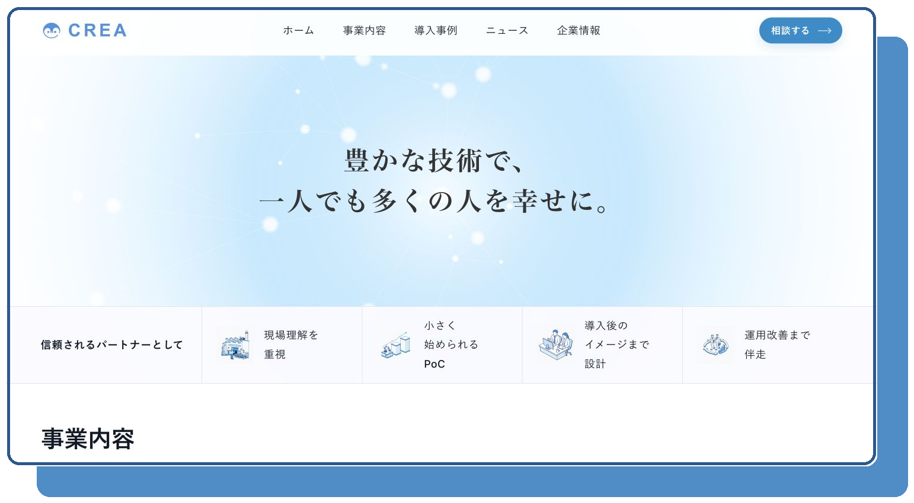
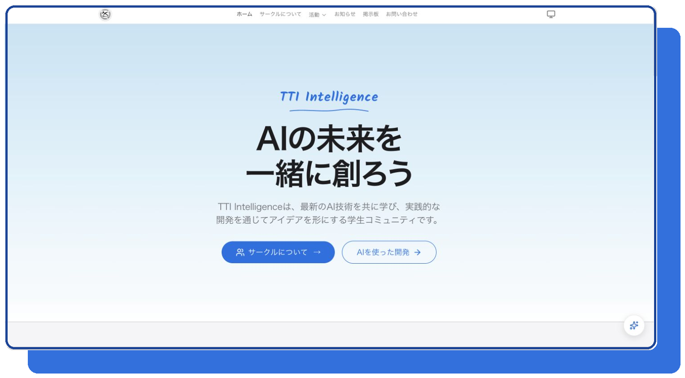
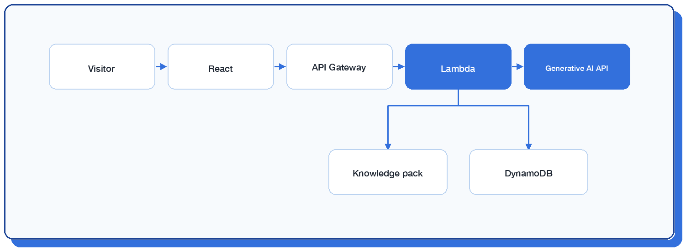

<b>AI / Web Developer</b>&nbsp;&nbsp;

Toyota Technological Institute, 2025–

企画・情報設計・デザイン・実装・公開後の運用まで、WebとAIを担当しています。

## Featured

### CREA Corporate Website

初めて訪れた人でも、事業と支援の姿勢が短時間でわかるようにしたコーポレートサイトです。

情報設計、デザイン、フロントエンド、バックエンド

[Website](https://tech-crea.com/)

### TTI Intelligence

学びと開発の成果を、継続して公開できるコミュニティの場として設計しています。

企画、UI、フロントエンド、バックエンド、AI、AWS、運用

[Website](https://tti-intel.com/) · [Source](https://github.com/haruhito0314/tti-intel-web)

TypeScript · React · AWS · 情報設計 · UI Design

制作背景は [portfolio](https://github.com/haruhito0314/portfolio) にまとめています。
