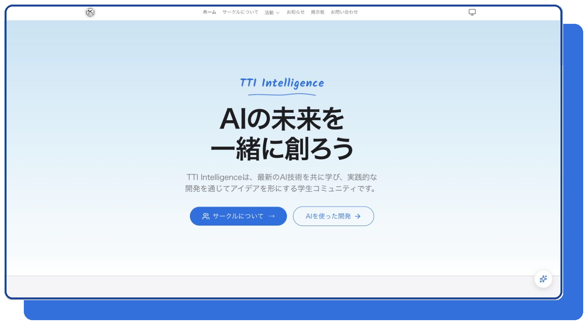
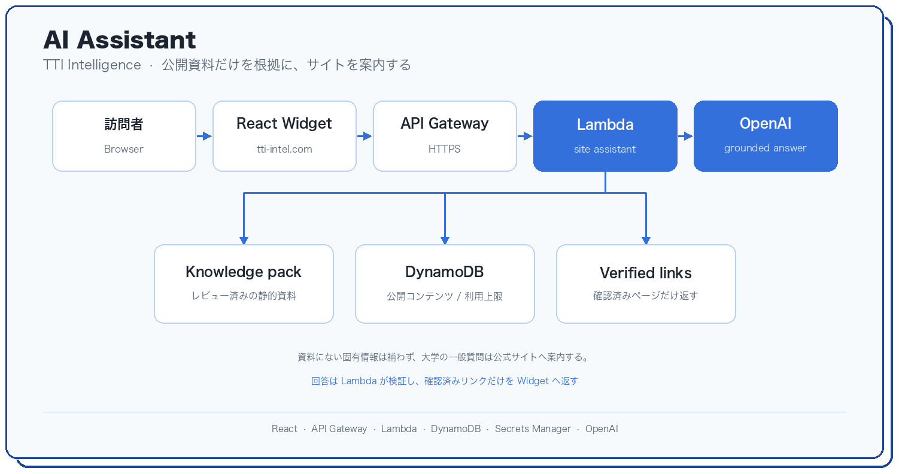

# Haruhito Mabuchi

**Web / AI Developer**

AIを使ったサービスと、コミュニティのためのWebアプリを作っています。  
企画・情報設計・UIデザインから、フロントエンド、バックエンド、インフラ、公開後の運用まで担当しています。

Toyota Technological Institute, 2025–

## Experience

**[SalesNow](https://salesnow.co.jp/) — Intern**  
2026.09 – Present

データ処理基盤の開発・改善と、AI生成データの品質改善に取り組んでいます。

## Featured Projects

### kikiha

**会議の会話を、字幕・翻訳・議事録へ。**

文字起こし、多言語翻訳、議事録・TODOの生成をまとめた会議AIアシスタントを開発しています。会議中の字幕共有から、会議後の振り返りまでをつなぐサービスです。

**Status:** 招待制・開発中  
**Tech:** Next.js · TypeScript · PostgreSQL · WebSocket

### TTI Intelligence

**学びと開発の成果を、継続して公開できる場所へ。**

豊田工業大学の学生を中心としたAI・開発コミュニティのWebサービスです。活動紹介、学習コンテンツ、掲示板、開発成果、サイト内AI Assistantをまとめています。

**Role:** 企画・情報設計・UIデザイン・フロントエンド・バックエンド・AI・AWS・運用  
**Tech:** React · TypeScript · AWS CDK · Lambda · DynamoDB

[Website](https://tti-intel.com/) · [Source Code](https://github.com/haruhito0314/tti-intel-web)

AI Assistantの構成

## Other Projects

- **[Discord Bot](https://github.com/haruhito0314/discord-bot)** — チャンネル管理、メッセージ履歴のバックアップ・復元、通話参加時間の記録など、コミュニティ運営を支えるBot。
- **ゼロから学ぶフルスタックWeb開発教材** — 教材本文、学習サイト、章別の参照実装をまとめたWeb開発教材。

## Technologies

TypeScript · JavaScript · React · Next.js · Node.js · PostgreSQL · AWS
