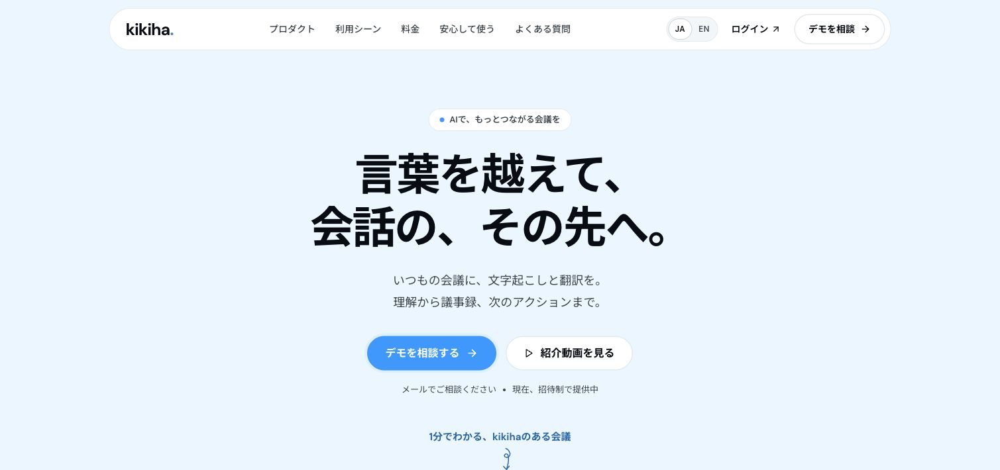
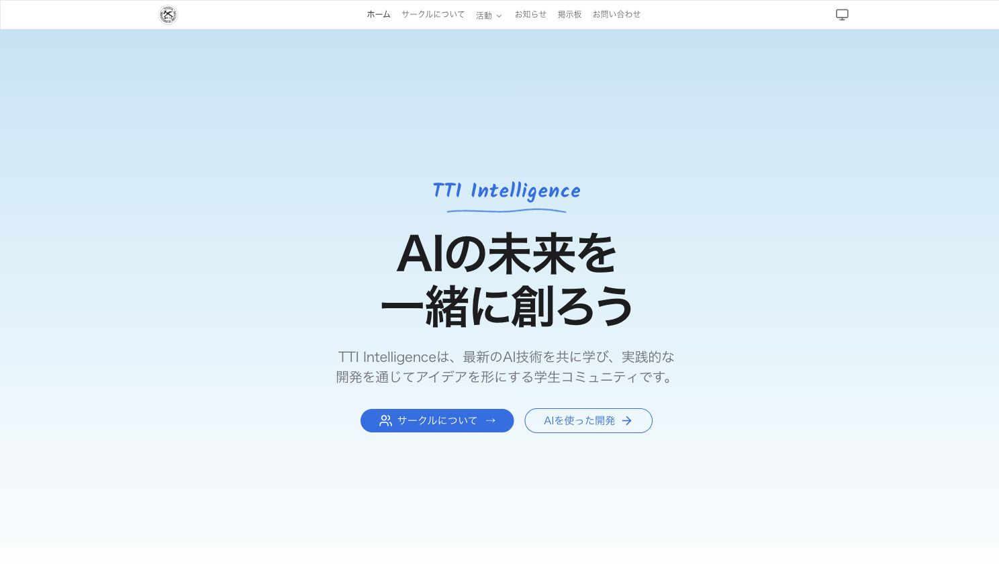

  

  <a href="https://kikiha.com/">kikiha</a> &nbsp; / &nbsp;
  <a href="https://tti-intel.com/">TTI Intelligence</a> &nbsp; / &nbsp;
  <a href="https://www.instagram.com/haruhito_314/">Instagram</a>

AIを使ったサービスと、コミュニティのためのWebアプリを作っています。  
企画・情報設計・UIデザインから、フロントエンド、バックエンド、インフラ、公開後の運用まで担当しています。

**Toyota Technological Institute** · 2025–

## Experience

| Company | Role | Period |
| :--- | :--- | :--- |
| **[AIサプリ](https://aisapuri.jp/company.html)** | Intern | 2026.10 – Present |
| **[SalesNow](https://salesnow.co.jp/about/)** | Intern | 2026.09 – Present |

SalesNowでは、データ処理基盤の開発・改善と、AI生成データの品質改善に取り組んでいます。

## Featured Projects

<table>
<tr>
<td width="50%" valign="top">

### kikiha

**会議の会話を、字幕・翻訳・議事録へ。**

文字起こし、多言語翻訳、議事録・TODOの生成をまとめた会議AIアシスタント。Zoom・Google Meet・Teamsやマイクでの会話を、リアルタイムの字幕から会議後の振り返り・共有までつなぎます。

サービス紹介サイト・紹介動画も制作しています。招待制で提供中・継続開発。

`Next.js` `TypeScript` `PostgreSQL` `WebSocket`

**[Website ↗](https://kikiha.com/)** · [紹介動画 ↗](https://kikiha.com/demo)

</td>
<td width="50%" valign="top">

### TTI Intelligence

**学びと開発の成果を、継続して公開できる場所へ。**

豊田工業大学の学生を中心としたAI・開発コミュニティのWebサービス。活動紹介、学習コンテンツ、掲示板、開発成果、サイト内AI Assistantをまとめています。

企画・設計・開発・AWS構築・運用を担当。

`React` `TypeScript` `AWS CDK` `Lambda` `DynamoDB`

**[Website ↗](https://tti-intel.com/)**

</td>
</tr>
</table>

## Other Projects

- **[CREA コーポレートサイト](https://tech-crea.com/)** — 株式会社CREAの企業サイトを、設計・デザインから実装・公開まで一貫して担当しました。
- **[Discord Bot](https://github.com/haruhito0314/discord-bot)** — チャンネル管理、メッセージ履歴のバックアップ・復元、通話参加時間の記録など、コミュニティ運営を支えるBot。

## Tech Stack

**Frontend** &nbsp; TypeScript · JavaScript · React · Next.js  
**Backend** &nbsp; Node.js · PostgreSQL · WebSocket  
**Infrastructure** &nbsp; AWS · CDK · Lambda · DynamoDB
